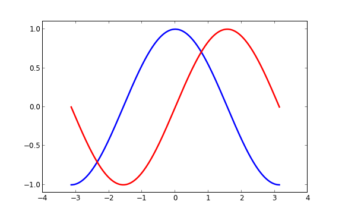
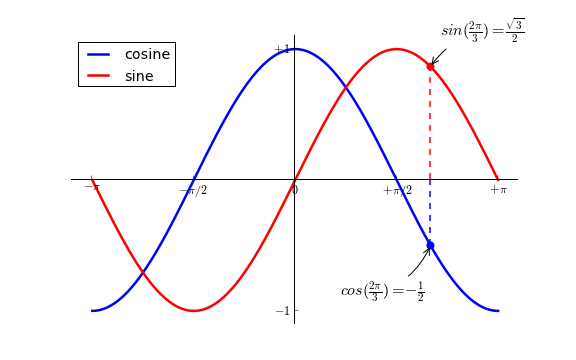
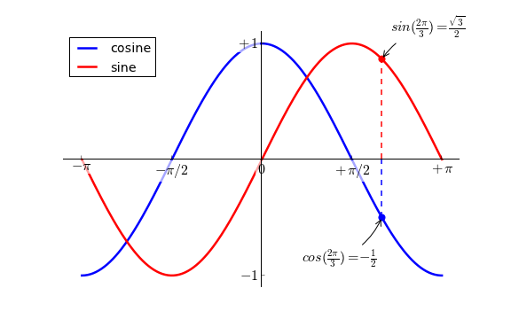
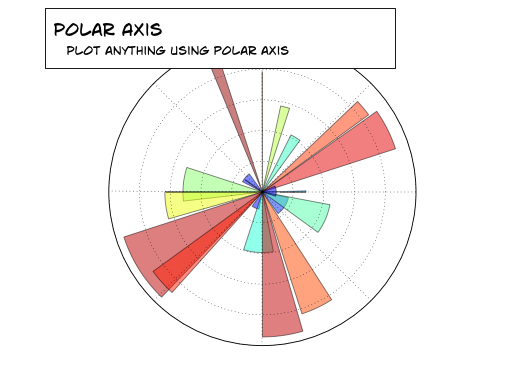
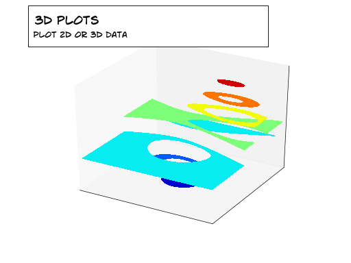

.. _matplotlib:

===================
Matplotlib tutorial
===================

:authors: Mike Müller, Nicolas P. Rougier
:audience: Beginner level

.. contents::
   :local:
   :depth: 1

Introduction
============

matplotlib is probably the single most used Python package for
2D-graphics. It provides both a very quick way to visualize data from Python
and publication-quality figures in many formats.  We are going to explore
matplotlib in interactive mode covering most common cases. We also look at the
class library which is provided with an object-oriented interface.

**IPython and the pylab mode**

`IPython <http://ipython.org/>`_ is an enhanced interactive Python shell that
has lots of interesting features including named inputs and outputs, access to
shell commands, improved debugging and many more. When we start it with the
command line argument -pylab (--pylab since IPython version 0.12), it
allows interactive matplotlib sessions that has Matlab/Mathematica-like
functionality.

**pylab**

pylab provides a procedural interface to the matplotlib object-oriented
plotting library. It is modeled closely after Matlab(TM). Therefore, the
majority of plotting commands in pylab has Matlab(TM) analogs with similar
arguments.  Important commands are explained with interactive examples.

Simple plot
===========

In this section, we want to draw the cosine and sine functions on the same
plot. Starting from the default settings, we'll enrich the figure step by step
to make it nicer.

First step is to get the data for the sine and cosine functions:

.. code-block:: python

   from pylab import *

   X = np.linspace(-np.pi, np.pi, 256,endpoint=True)
   C,S = np.cos(X), np.sin(X)

X is now a numpy array with 256 values ranging from -π to +π (included). C is
the cosine (256 values) and S is the sine (256 values).

For running example, you can type them in an IPython interactive session

    $ ipython -pylab

This brings us to the IPython prompt:

.. code-block:: python

    IPython 0.8.1 -- An enhanced Interactive Python.
    ?       -> Introduction to IPython's features.
    %magic  -> Information about IPython's 'magic' % functions.
    help    -> Python's own help system.
    object? -> Details about 'object'. ?object also works, ?? prints more.
    
    Welcome to pylab, a matplotlib-based Python environment.
    For more information, type 'help(pylab)'.

or you can download each of the example and run it using regular python:

    $ python exercice_1.py

Using defaults
--------------

.. image:: figures/exercice_1.png
   :align: right

Matplotlib comes with a set of default settings that allow to customize all
kinds of properties. You can `control
<http://matplotlib.sourceforge.net/users/customizing.html>`_ the defaults of
almost every property in matplotlib: figure size and dpi, line width, color and
style, axes, axis and grid properties, text and font properties and so on.

.. code-block:: python

   from pylab import *

   X = np.linspace(-np.pi, np.pi, 256,endpoint=True)
   C,S = np.cos(X), np.sin(X)

   plot(X,C)
   plot(X,S)

   show()

**Documentation reference**

 * `plot tutorial <http://matplotlib.sourceforge.net/users/pyplot_tutorial.html>`_
 * `plot() command <http://matplotlib.sourceforge.net/api/pyplot_api.html#matplotlib.pyplot.plot>`_

Instantiating defaults
----------------------

.. image:: figures/exercice_2.png
   :align: right

In the script below, we've instantiated (and commented) all figure settings
such that it shows what are the default settings that influence the
rendering. We obtain the exact same figure but now you can play with the
different parameters to explore how they affect rendering (see `Line
properties`_ and `Line styles`_ below).

.. code-block:: python

   # Import everything from matplotlib (numpy is accessible via 'np' alias)
   from pylab import *

   # Create a new figure of size 8x6 points, using 100 dots per inch
   figure(figsize=(8,6), dpi=80)

   # Create a new subplot from a grid of 1x1
   subplot(111)

   X = np.linspace(-np.pi, np.pi, 256,endpoint=True)
   C,S = np.cos(X), np.sin(X)

   # Plot cosine using blue color with a continuous line of width 1 (pixels)
   plot(X, C, color="blue", linewidth=1.0, linestyle="-")

   # Plot sine using green color with a continuous line of width 1 (pixels)
   plot(X, S, color="green", linewidth=1.0, linestyle="-")

   # Set x limits
   xlim(-4.0,4.0)

   # Set x ticks
   xticks(np.linspace(-4,4,9,endpoint=True))

   # Set y limits
   ylim(-1.0,1.0)

   # Set y ticks
   yticks(np.linspace(-1,1,5,endpoint=True))

   # Save figure using 72 dots per inch
   # savefig("exercice_2.png",dpi=72)

   # Show result on screen
   show()

**Documentation reference**

 * `Customizing matplotlib <http://matplotlib.sourceforge.net/users/customizing.html>`_

Changing colors and line widths
--------------------------------

.. image:: figures/exercice_3.png
   :align: right

First step, we want to have the cosine in blue and the sine in red and a
slighty thicker line for both of them. We'll also slightly alter the figure
size to make it more horizontal.

.. code-block:: python

   ...
   figure(figsize=(10,6), dpi=80)
   plot(X, C, color="blue", linewidth=2.5, linestyle="-")
   plot(X, S, color="red",  linewidth=2.5, linestyle="-")
   ...

**Complete source**: `exercice_3.py <scripts/exercice_3.py>`_

**Documentation reference**

 * `Controlling line properties <http://matplotlib.sourceforge.net/users/pyplot_tutorial.html#controlling-line-properties>`_
 * `Line api <http://matplotlib.sourceforge.net/api/artist_api.html#matplotlib.lines.Line2D>`_

Setting limits
--------------

Current limits of the figure are a bit too tight and we want to make some space
in order to clearly see all data points.

.. code-block:: python

   ...
   xlim(X.min()*1.1, X.max()*1.1)
   ylim(C.min()*1.1, C.max()*1.1)
   ...

**Complete source**: `exercice_4.py <scripts/exercice_4.py>`_

**Documentation reference**

 * `xlim() command <http://matplotlib.sourceforge.net/api/pyplot_api.html#matplotlib.pyplot.xlim>`_
 * `ylim() command <http://matplotlib.sourceforge.net/api/pyplot_api.html#matplotlib.pyplot.ylim>`_

Setting ticks
-------------

.. image:: figures/exercice_5.png
   :align: right

Current ticks are not so good because they do not show interesting values
(+/-π,+/-π/2) for sine and cosine. We'll change them such that they show only
these values.

.. code-block:: python

   ...
   xticks( [-np.pi, -np.pi/2, 0, np.pi/2, np.pi])
   yticks([-1, 0, +1])
   ...

**Complete source**: `exercice_5.py <scripts/exercice_5.py>`_

**Documentation reference**

 * `xticks() command <http://matplotlib.sourceforge.net/api/pyplot_api.html#matplotlib.pyplot.xticks>`_
 * `yticks() command <http://matplotlib.sourceforge.net/api/pyplot_api.html#matplotlib.pyplot.yticks>`_
 * `Tick container <http://matplotlib.sourceforge.net/users/artists.html#axis-container>`_
 * `Tick locating and formatting <http://matplotlib.sourceforge.net/api/ticker_api.html>`_

Setting tick labels
-------------------

.. image:: figures/exercice_6.png
   :align: right

Ticks are now properly placed but their label is not very explicit. We could
guess that 3.142 is π but it would be better to make it explicit. When we set
ticks values, we can also provide a corresponding label in the second argument
list. Note that we'll use latex to allow for nice rendering of the label.

.. code-block:: python

   ...
   xticks( [-np.pi,    -np.pi/2,    0,      np.pi/2,     np.pi],
           [r'$-\pi$', r'$-\pi/2$', r'$0$', r'$+\pi/2$', r'$+\pi$'])

   yticks( [-1,  0,   +1],
           [r'$-1$', r'$0$', r'$+1$'])
   ...

**Complete source**: `exercice_6.py <scripts/exercice_6.py>`_

**Documentation reference**

 * `xticks() command <http://matplotlib.sourceforge.net/api/pyplot_api.html#matplotlib.pyplot.xticks>`_
 * `yticks() command <http://matplotlib.sourceforge.net/api/pyplot_api.html#matplotlib.pyplot.yticks>`_
 * `set_xticklabels() <http://matplotlib.sourceforge.net/api/axes_api.html?#matplotlib.axes.Axes.set_xticklabels>`_
 * `set_yticklabels() <http://matplotlib.sourceforge.net/api/axes_api.html?#matplotlib.axes.Axes.set_yticklabels>`_
 * `Working with text <http://matplotlib.sourceforge.net/users/index_text.html>`_

Moving spines
-------------

.. image:: figures/exercice_7.png
   :align: right

Spines are the lines connecting the axis tick marks and noting the boundaries
of the data area. They can be placed at arbitrary positions and until now, they
were on the border of the axis. We'll change that since we want to have them in
the middle. Since there are four of them (top/bottom/left/right), we'll discard
the top and right by setting their color to none and we'll move the bottom and
left ones to coordinate 0 in data space coordinates.

.. code-block:: python

   ...
   ax = gca()
   ax.spines['right'].set_color('none')
   ax.spines['top'].set_color('none')
   ax.xaxis.set_ticks_position('bottom')
   ax.spines['bottom'].set_position(('data',0))
   ax.yaxis.set_ticks_position('left')
   ax.spines['left'].set_position(('data',0))
   ...

**Complete source**: `exercice_7.py <scripts/exercice_7.py>`_

**Documentation reference**

 * `Spines <http://matplotlib.sourceforge.net/api/spines_api.html#matplotlib.spines>`_
 * `Axis container <http://matplotlib.sourceforge.net/users/artists.html#axis-container>`_
 * `Transformations tutorial <http://matplotlib.sourceforge.net/users/transforms_tutorial.html>`_

Adding a legend
---------------

.. image:: figures/exercice_8.png
   :align: right

Let's add a legend in the upper left corner. This only requires to give each
plot a label that will be used in the legend box.

.. code-block:: python

   ...
   plot(X, C, color="blue", linewidth=2.5, linestyle="-", label="cosine")
   plot(X, S, color="red", linewidth=2.5, linestyle="-",  label="sine")

   legend(loc='upper left')
   ...

**Complete source**: `exercice_8.py <scripts/exercice_8.py>`_

**Documentation reference**:

 * `Legend guide <http://matplotlib.sourceforge.net/users/legend_guide.html>`_
 * `legend() command <http://matplotlib.sourceforge.net/api/pyplot_api.html#matplotlib.pyplot.legend>`_
 * `Legend api <http://matplotlib.sourceforge.net/api/legend_api.html#matplotlib.legend.Legend>`_

Annotate some points
--------------------

Let's annotate some interesting point using the annotate command.

.. code-block:: python

   ...

   t = 2*np.pi/3
   plot([t,t],[0,np.cos(t)], color ='blue', linewidth=2.5, linestyle="--")
   scatter([t,],[np.cos(t),], 50, color ='blue')

   annotate(r'$sin(\frac{2\pi}{3})=-\frac{\sqrt{3}}{2}$', xy=(t, np.sin(t)),  xycoords='data',
            xytext=(+10, +30), textcoords='offset points', fontsize=16,
            arrowprops=dict(arrowstyle="->", connectionstyle="arc3,rad=.2"))

   plot([t,t],[0,np.sin(t)], color ='red', linewidth=2.5, linestyle="--")
   scatter([t,],[np.sin(t),], 50, color ='red')

   annotate(r'$cos(\frac{2\pi}{3})=-\frac{1}{2}$', xy=(t, np.cos(t)),  xycoords='data',
            xytext=(-90, -50), textcoords='offset points', fontsize=16,
            arrowprops=dict(arrowstyle="->", connectionstyle="arc3,rad=.2"))
   ...

**Complete source**: `exercice_9.py <scripts/exercice_9.py>`_

**Documentation reference**

 * `Annotating axis <http://matplotlib.sourceforge.net/users/annotations_guide.html>`_
 * `annotate() command <http://matplotlib.sourceforge.net/api/pyplot_api.html#matplotlib.pyplot.annotate>`_

Devil is in the details
------------------------

Tick labels are now hardly visible because of the blue and red lines. We can
make them bigger and we can also adjust their properties such that they'll be
rendered on a semi-transparent white background. This will allow us to see both
the data and the labels.

.. code-block:: python

   ...
   for label in ax.get_xticklabels() + ax.get_yticklabels():
       label.set_fontsize(16)
       label.set_bbox(dict(facecolor='white', edgecolor='None', alpha=0.65 ))
   ...

**Complete source**: `exercice_10.py <scripts/exercice_10.py>`_

**Documentation reference**

 * `Artists <http://matplotlib.sourceforge.net/api/artist_api.html>`_
 * `Text.set_bbox() <http://matplotlib.sourceforge.net/api/artist_api.html#matplotlib.text.Text.set_bbox>`_

Figures, Subplots, and Axes
===========================

So far we have used implicit figure and axes creation.  This is handy for fast
plots. We can have more control over the display using figure, subplot,
and axes explicitly.  A figure in matplotlib means the whole window
in the user interface. Within this figure there can be subplots.  While
subplot positions the plots in a regular grid, axes allows free
placement within the figure. Both can be useful depending on your
intention.  We've already work with figures and subplots without explicitly
calling them.  When we call plot matplotlib calls gca() to get the
current axes and gca in turn calls gcf() to get the current figure. If
there is none it calls figure() to make one, strictly speaking, to make a
subplot(111).  Let's look at the details.

Figures
-------

A figure is the windows in the GUI that has "Figure #" as title. Figures
are numbered starting from 1 as opposed to the normal Python way starting
from 0. This is clearly MATLAB-style.  There are several parameters that
determine how the figure looks like:

==============  ======================= ============================================
Argument        Default                 Description
==============  ======================= ============================================
num             1                       number of figure
figsize         figure.figsize          figure size in in inches (width, height)
dpi             figure.dpi              resolution in dots per inch
facecolor       figure.facecolor        color of the drawing background
edgecolor       figure.edgecolor        color of edge around the drawing background
frameon         True                    draw figure frame or not
==============  ======================= ============================================

The defaults can be specified in the resource file and will be used most of the
time. Only the number of the figure is frequently changed.

When you work with the GUI you can close a figure by clicking on the x in the
upper right corner. But you can close a figure programmatically by calling
close. Depending on the argument it closes (1) the current figure (no
argument), (2) a specific figure (figure number or figure instance as
argument), or (3) all figures (all as argument).

As with other objects, you can set figure properties also setp or with the
set_something methods.

Subplots
--------

With subplot you can arrange plots in regular grid. You need to specify the
number of rows and columns and the number of the plot.

.. image:: figures/subplot-horizontal.png
.. image:: figures/subplot-vertical.png
.. image:: figures/subplot-grid.png

**Sources**

 * `subplot-horizontal.py <scripts/subplot-horizontal.py>`_
 * `subplot-vertical.py <scripts/subplot-vertical.py>`_
 * `subplot-grid.py <scripts/subplot-grid.py>`_

Axes
----

Axes are very similar to subplots but allow placement of plots at any location
in the figure.  So if we want to put a smaller plot inside a bigger one we do
so with axes:

.. image:: figures/axes.png
.. image:: figures/axes-2.png

**Sources**

 * `axes.py <scripts/axes.py>`_
 * `axes-2.py <scripts/axes-2.py>`_

Ticks
=====

Where and What
--------------

Well formatted ticks are an important part of publishing-ready
figures. ``matplotlib`` provides a totally configurable system
for ticks. There are tick locators to specify where ticks
should appear and tick formatters to make ticks look like the way you want.
Major and minor ticks can be located and formatted independently from
each other. Per default minor ticks are not shown, i.e. there is only
an empty list for them because it is as ``NullLocator`` (see below).

Tick Locators
-------------

There are several locators for different kind of requirements:

=============== ===============================================================
Class           Description
=============== ===============================================================
NullLocator     no ticks
IndexLocator    locator for index plots (e.g. where ``x = range(len(y)``)
LinearLocator   evenly spaced ticks from min to max
LogLocator      logarithmically ticks from min to max
MultipleLocator ticks and range are a multiple of base; either integer or float
AutoLocator     choose a MultipleLocator and dynamically reassign
=============== ===============================================================

All of these locators derive from the base class ``matplotlib.ticker.Locator``.
You can make your own locator deriving from it.

Handling dates as ticks can be especially tricky. Therefore, ``matplotlib``
provides special locators in ``matplotlib.dates``:

======================= ===========================================
Class                   Description
======================= ===========================================
MinuteLocator           locate minutes
HourLocator             locate hours
DayLocator              locate specified days of the month
WeekdayLocator          locate days of the week, e.g. MO, TU
MonthLocator            locate months, e.g. 10 for October
YearLocator             locate years that are multiples of base
RRuleLocator            locate using a matplotlib.dates.rrule
======================= ===========================================

Tick Formatters
---------------

Similarly to locators, there are formatters:

======================= =============================================
Class                   Description
======================= =============================================
NullFormatter           no labels on the ticks
FixedFormatter          set the strings manually for the labels
FuncFormatter           user defined function sets the labels
FormatStrFormatter      use a sprintf format string
IndexFormatter          cycle through fixed strings by tick position
ScalarFormatter         default formatter for scalars;
                        autopick the fmt string
LogFormatter            formatter for log axes
DateFormatter           use an strftime string to format the date
======================= =============================================

All of these formatters derive from the base class ``matplotlib.ticker.Formatter``.
You can make your own formatter deriving from it.

Now we set our major locator to 2 and the minor locator
to 1. We also format the numbers as decimals using the
``FormatStrFormatter``::

    >>> major_locator = pl.MultipleLocator(2)
    >>> major_formatter = pl.FormatStrFormatter('%5.2f')
    >>> minor_locator = pl.MultipleLocator(1)
    >>> ax.xaxis.set_major_locator(major_locator)
    >>> ax.xaxis.set_minor_locator(minor_locator)
    >>> ax.xaxis.set_major_formatter(major_formatter)
    >>> pl.draw()

Other Types of Plots
====================

.. image:: figures/plot.png
   :target: `Regular Plots`_

.. image:: figures/scatter.png
   :target: `Scatter Plots`_

.. image:: figures/bar.png
   :target: `Bar Plots`_

.. image:: figures/contour.png
   :target: `Contour Plots`_

.. image:: figures/imshow.png
   :target: `Imshow`_

.. image:: figures/quiver.png
   :target: `Quiver Plots`_

.. image:: figures/pie.png
   :target: `Pie Charts`_

.. image:: figures/grid.png
   :target: `Grids`_

.. image:: figures/multiplot.png
   :target: `Multi Plots`_

.. image:: figures/text.png
   :target: `Text`_

Regular Plots
-------------

.. image:: figures/plot.png
   :align: right

.. code-block:: python

   from pylab import *

   n = 256
   X = np.linspace(0,2,n)
   Y = np.sin(2*np.pi*X)
   plot(X,Y), show()

**Exercice**

  Starting from the code above, try to reproduce the graphic on the right taking
  care of axis limits, line width and color.

**Hints**

  You can set ticks with an empty list.

**Solution**

  Click `here <scripts/plot_ex.py>`_ for the solution

Scatter Plots
-------------

.. image:: figures/scatter.png
   :align: right

.. code-block:: python

   from pylab import *

   n = 1024
   X = np.random.normal(0,1,n)
   Y = np.random.normal(0,1,n)
   scatter(X,Y), show()

**Exercice**

  Starting from the code above, try to reproduce the graphic on the right taking
  care of axis limits, markers size and color and transparency.

**Hints**

  Color is given by angle.

**Solution**

  Click `here <scripts/scatter_ex.py>`_ for the solution

Bar Plots
---------

.. image:: figures/bar.png
   :align: right

.. code-block:: python

   from pylab import *

   X = np.arange(n)
   Y1 = (1-X/float(n)) * np.random.uniform(0.5,1.0,n)
   Y2 = (1-X/float(n)) * np.random.uniform(0.5,1.0,n)
   bar(X, Y1)

**Exercice**

  Starting from the code above, try to reproduce the graphic on the right taking
  care of axis limits, bars size and color.

**Hints**

  You'll need two bar plots.

**Solution**

  Click `here <scripts/bar_ex.py>`_ for the solution

Contour Plots
-------------

.. image:: figures/contour.png
   :align: right

.. code-block:: python

   from pylab import *

   def f(x,y): return (1-x/2+x**5+y**3)*np.exp(-x**2-y**2)

   n = 256
   x = np.linspace(-3,3,n)
   y = np.linspace(-3,3,n)
   X,Y = np.meshgrid(x,y)
   contour(X,Y,f(X,Y))
   show()

**Exercice**

  Starting from the code above, try to reproduce the graphic on the right taking
  care of fills and lines, transparency, number of contours and colors.

**Hints**

  You'll need two an additional contourf plot.

**Solution**

  Click `here <scripts/contour_ex.py>`_ for the solution

Imshow
------

.. image:: figures/imshow.png
   :align: right

.. code-block:: python

   from pylab import *

   n = 32
   Z = np.random.uniform(0,1,(n,n))
   imshow(Z), show()

**Exercice**

  Starting from the code above, try to reproduce the graphic on the right taking
  care of colormaps, axis aspects and image interpolation.

**Hints**

  You need to take care of the 'origin' of the image in the imshow command.

**Solution**

  Click `here <scripts/imshow_ex.py>`_ for the solution

Pie Charts
----------

.. image:: figures/pie.png
   :align: right

.. code-block:: python

   from pylab import *

   n = 20
   Z = np.random.uniform(0,1,n)
   pie(Z), show()

**Exercice**

  Starting from the code above, try to reproduce the graphic on the right taking
  care of colors and slices size.

**Hints**

  You need to modify Z.

**Solution**

  Click `here <scripts/pie_ex.py>`_ for the solution

Quiver Plots
------------

.. image:: figures/quiver.png
   :align: right

.. code-block:: python

   from pylab import *

   n = 8
   X,Y = np.mgrid[0:n,0:n]
   quiver(X,Y), show()

**Exercice**

  Starting from the code above, try to reproduce the graphic on the right taking
  care of colors and orientations.

**Hints**

  You need to draw arrows twice.

**Solution**

  Click `here <scripts/quiver_ex.py>`_ for the solution

Grids
-----

.. image:: figures/grid.png
   :align: right

.. code-block:: python

   from pylab import *

   axes = gca()
   axes.set_xlim(0,4)
   axes.set_ylim(0,3)
   axes.set_xticklabels([])
   axes.set_yticklabels([])

   show()

**Exercice**

  Starting from the code above, try to reproduce the graphic on the right taking
  care of line styles for the grid

**Solution**

  Click `here <scripts/grid_ex.py>`_ for the solution

Multi Plots
-----------

.. image:: figures/multiplot.png
   :align: right

.. code-block:: python

   from pylab import *

   subplot(2,2,1)
   subplot(2,2,3)
   subplot(2,2,4)

   show()

**Exercice**

  Starting from the code above, try to reproduce the graphic on the right.

**Hints**

  You can use several subplots with different partition.

**Solution**

  Click `here <scripts/multiplot_ex.py>`_ for the solution

Polar Axis
----------

3D Plots
--------

Text
--------

.. image:: figures/text.png
   :align: right

Quick references
================

Line properties
----------------

=============== ======================================== =======================================
Property        Value
=============== ======================================== =======================================
alpha           alpha transparency on 0-1 scale          .. image:: figures/alpha.png
                                                            :target: figures/alpha-big.png
antialiased     True or False - use antialised rendering .. image:: figures/antialiased.png
                                                            :target: figures/antialiased-big.png
color           matplotlib color arg                     .. image:: figures/color.png
                                                            :target: figures/color-big.png
linestyle       see below
linewidth       float, the line width in points          .. image:: figures/linewidth.png
                                                            :target: figures/linewidth-big.png
marker          see below
markeredgewidth line width around the marker symbol      .. image:: figures/mew.png
                                                            :target: figures/mew-big.png
markeredgecolor edge color if a marker is used           .. image:: figures/mec.png
                                                            :target: figures/mec-big.png
markerfacecolor face color if a marker is used           .. image:: figures/mfc.png
                                                            :target: figures/mfc-big.png
markersize      size of the marker in points             .. image:: figures/ms.png
                                                            :target: figures/ms-big.png
=============== ======================================== =======================================

Line styles
-----------

=========== ====================================== ========================================
Symbol      Description                            Appearance
=========== ====================================== ========================================
 ``-``      solid line                             .. image:: figures/linestyle--.png
                                                      :target: figures/linestyle---big.png
 ``--``     dashed line                            .. image:: figures/linestyle---.png
                                                      :target: figures/linestyle----big.png
 ``-.``     dash-dot line                          .. image:: figures/linestyle--..png
                                                      :target: figures/linestyle--.-big.png
 ``:``      dotted line                            .. image:: figures/linestyle-:.png
                                                      :target: figures/linestyle-:-big.png
 ``.``      points                                 .. image:: figures/linestyle-..png
                                                     :target: figures/linestyle-.-big.png
 ``,``      pixels                                 .. image:: figures/linestyle-,.png
                                                     :target: figures/linestyle-,-big.png
 ``o``      circle symbols                         .. image:: figures/linestyle-o.png
                                                     :target: figures/linestyle-o-big.png
 ``^``      triangle up symbols                    .. image:: figures/linestyle-^.png
                                                     :target: figures/linestyle-^-big.png
 ``v``      triangle down symbols                  .. image:: figures/linestyle-v.png
                                                     :target: figures/linestyle-v-big.png
 ``<``      triangle left symbols                  .. image:: figures/linestyle-<.png
                                                     :target: figures/linestyle-<-big.png
 ``>``      triangle right symbols                 .. image:: figures/linestyle->.png
                                                     :target: figures/linestyle->-big.png
 ``s``      square symbols                         .. image:: figures/linestyle-s.png
                                                     :target: figures/linestyle-s-big.png
 ``+``      plus symbols                           .. image:: figures/linestyle-+.png
                                                     :target: figures/linestyle-+-big.png
 ``x``      cross symbols                          .. image:: figures/linestyle-x.png
                                                     :target: figures/linestyle-x-big.png
 ``D``      diamond symbols                        .. image:: figures/linestyle-D.png
                                                     :target: figures/linestyle-D-big.png
 ``d``      thin diamond symbols                   .. image:: figures/linestyle-d.png
                                                     :target: figures/linestyle-d-big.png
 ``1``      tripod down symbols                    .. image:: figures/linestyle-1.png
                                                     :target: figures/linestyle-1-big.png
 ``2``      tripod up symbols                      .. image:: figures/linestyle-2.png
                                                     :target: figures/linestyle-2-big.png
 ``3``      tripod left symbols                    .. image:: figures/linestyle-3.png
                                                     :target: figures/linestyle-3-big.png
 ``4``      tripod right symbols                   .. image:: figures/linestyle-4.png
                                                     :target: figures/linestyle-4-big.png
 ``h``      hexagon symbols                        .. image:: figures/linestyle-h.png
                                                     :target: figures/linestyle-h-big.png
 ``H``      rotated hexagon symbols                .. image:: figures/linestyle-H.png
                                                     :target: figures/linestyle-H-big.png
 ``p``      pentagon symbols                       .. image:: figures/linestyle-p.png
                                                     :target: figures/linestyle-p-big.png
 ``|``      vertical line symbols                  .. image:: figures/linestyle-|.png
                                                     :target: figures/linestyle-|-big.png
 ``_``      horizontal line symbols                .. image:: figures/linestyle-_.png
                                                     :target: figures/linestyle-_-big.png
=========== ====================================== ========================================

Colormaps
---------

============= ================================================ ============= ================================================ 
Name          Appearance                                       Name          Appearance                                       
============= ================================================ ============= ================================================ 
Accent        .. image:: figures/cmap-Accent.png               Blues         .. image:: figures/cmap-Blues.png               
                 :target: figures/cmap-Accent-big.png                           :target: figures/cmap-Blues-big.png          
BrBG          .. image:: figures/cmap-BrBG.png                 BuGn          .. image:: figures/cmap-BuGn.png                
                 :target: figures/cmap-BrBG-big.png                             :target: figures/cmap-BuGn-big.png           
BuPu          .. image:: figures/cmap-BuPu.png                 CMRmap        .. image:: figures/cmap-CMRmap.png              
                 :target: figures/cmap-BuPu-big.png                             :target: figures/cmap-CMRmap-big.png         
Dark2         .. image:: figures/cmap-Dark2.png                GnBu          .. image:: figures/cmap-GnBu.png                
                 :target: figures/cmap-Dark2-big.png                            :target: figures/cmap-GnBu-big.png           
Greens        .. image:: figures/cmap-Greens.png               Greys         .. image:: figures/cmap-Greys.png               
                 :target: figures/cmap-Greens-big.png                           :target: figures/cmap-Greys-big.png          
OrRd          .. image:: figures/cmap-OrRd.png                 Oranges       .. image:: figures/cmap-Oranges.png             
                 :target: figures/cmap-OrRd-big.png                             :target: figures/cmap-Oranges-big.png        
PRGn          .. image:: figures/cmap-PRGn.png                 Paired        .. image:: figures/cmap-Paired.png              
                 :target: figures/cmap-PRGn-big.png                             :target: figures/cmap-Paired-big.png         
Pastel1       .. image:: figures/cmap-Pastel1.png              Pastel2       .. image:: figures/cmap-Pastel2.png             
                 :target: figures/cmap-Pastel1-big.png                          :target: figures/cmap-Pastel2-big.png        
PiYG          .. image:: figures/cmap-PiYG.png                 PuBu          .. image:: figures/cmap-PuBu.png                
                 :target: figures/cmap-PiYG-big.png                             :target: figures/cmap-PuBu-big.png           
PuBuGn        .. image:: figures/cmap-PuBuGn.png               PuOr          .. image:: figures/cmap-PuOr.png                
                 :target: figures/cmap-PuBuGn-big.png                           :target: figures/cmap-PuOr-big.png           
PuRd          .. image:: figures/cmap-PuRd.png                 Purples       .. image:: figures/cmap-Purples.png             
                 :target: figures/cmap-PuRd-big.png                             :target: figures/cmap-Purples-big.png        
RdBu          .. image:: figures/cmap-RdBu.png                 RdGy          .. image:: figures/cmap-RdGy.png                
                 :target: figures/cmap-RdBu-big.png                             :target: figures/cmap-RdGy-big.png           
RdPu          .. image:: figures/cmap-RdPu.png                 RdYlBu        .. image:: figures/cmap-RdYlBu.png              
                 :target: figures/cmap-RdPu-big.png                             :target: figures/cmap-RdYlBu-big.png         
RdYlGn        .. image:: figures/cmap-RdYlGn.png               Reds          .. image:: figures/cmap-Reds.png                
                 :target: figures/cmap-RdYlGn-big.png                           :target: figures/cmap-Reds-big.png           
Set1          .. image:: figures/cmap-Set1.png                 Set2          .. image:: figures/cmap-Set2.png                
                 :target: figures/cmap-Set1-big.png                             :target: figures/cmap-Set2-big.png           
Set3          .. image:: figures/cmap-Set3.png                 Spectral      .. image:: figures/cmap-Spectral.png            
                 :target: figures/cmap-Set3-big.png                             :target: figures/cmap-Spectral-big.png       
YlGn          .. image:: figures/cmap-YlGn.png                 YlGnBu        .. image:: figures/cmap-YlGnBu.png              
                 :target: figures/cmap-YlGn-big.png                             :target: figures/cmap-YlGnBu-big.png         
YlOrBr        .. image:: figures/cmap-YlOrBr.png               YlOrRd        .. image:: figures/cmap-YlOrRd.png              
                 :target: figures/cmap-YlOrBr-big.png                           :target: figures/cmap-YlOrRd-big.png         
afmhot        .. image:: figures/cmap-afmhot.png               autumn        .. image:: figures/cmap-autumn.png              
                 :target: figures/cmap-afmhot-big.png                           :target: figures/cmap-autumn-big.png         
binary        .. image:: figures/cmap-binary.png               bone          .. image:: figures/cmap-bone.png                
                 :target: figures/cmap-binary-big.png                           :target: figures/cmap-bone-big.png           
brg           .. image:: figures/cmap-brg.png                  bwr           .. image:: figures/cmap-bwr.png                 
                 :target: figures/cmap-brg-big.png                              :target: figures/cmap-bwr-big.png            
cool          .. image:: figures/cmap-cool.png                 coolwarm      .. image:: figures/cmap-coolwarm.png            
                 :target: figures/cmap-cool-big.png                             :target: figures/cmap-coolwarm-big.png       
copper        .. image:: figures/cmap-copper.png               cubehelix     .. image:: figures/cmap-cubehelix.png           
                 :target: figures/cmap-copper-big.png                           :target: figures/cmap-cubehelix-big.png      
flag          .. image:: figures/cmap-flag.png                 gist_earth    .. image:: figures/cmap-gist_earth.png          
                 :target: figures/cmap-flag-big.png                             :target: figures/cmap-gist_earth-big.png     
gist_gray     .. image:: figures/cmap-gist_gray.png            gist_heat     .. image:: figures/cmap-gist_heat.png           
                 :target: figures/cmap-gist_gray-big.png                        :target: figures/cmap-gist_heat-big.png      
gist_ncar     .. image:: figures/cmap-gist_ncar.png            gist_rainbow  .. image:: figures/cmap-gist_rainbow.png        
                 :target: figures/cmap-gist_ncar-big.png                        :target: figures/cmap-gist_rainbow-big.png   
gist_stern    .. image:: figures/cmap-gist_stern.png           gist_yarg     .. image:: figures/cmap-gist_yarg.png           
                 :target: figures/cmap-gist_stern-big.png                       :target: figures/cmap-gist_yarg-big.png      
gnuplot       .. image:: figures/cmap-gnuplot.png              gnuplot2      .. image:: figures/cmap-gnuplot2.png            
                 :target: figures/cmap-gnuplot-big.png                          :target: figures/cmap-gnuplot2-big.png       
gray          .. image:: figures/cmap-gray.png                 hot           .. image:: figures/cmap-hot.png                 
                 :target: figures/cmap-gray-big.png                             :target: figures/cmap-hot-big.png            
hsv           .. image:: figures/cmap-hsv.png                  jet           .. image:: figures/cmap-jet.png                 
                 :target: figures/cmap-hsv-big.png                              :target: figures/cmap-jet-big.png            
ocean         .. image:: figures/cmap-ocean.png                pink          .. image:: figures/cmap-pink.png                
                 :target: figures/cmap-ocean-big.png                            :target: figures/cmap-pink-big.png           
prism         .. image:: figures/cmap-prism.png                rainbow       .. image:: figures/cmap-rainbow.png             
                 :target: figures/cmap-prism-big.png                            :target: figures/cmap-rainbow-big.png        
seismic       .. image:: figures/cmap-seismic.png              spectral      .. image:: figures/cmap-spectral.png            
                 :target: figures/cmap-seismic-big.png                          :target: figures/cmap-spectral-big.png       
spring        .. image:: figures/cmap-spring.png               summer        .. image:: figures/cmap-summer.png              
                 :target: figures/cmap-spring-big.png                           :target: figures/cmap-summer-big.png         
terrain       .. image:: figures/cmap-terrain.png              winter        .. image:: figures/cmap-winter.png              
                 :target: figures/cmap-terrain-big.png                          :target: figures/cmap-winter-big.png         
============= ================================================ ============= ================================================ 
